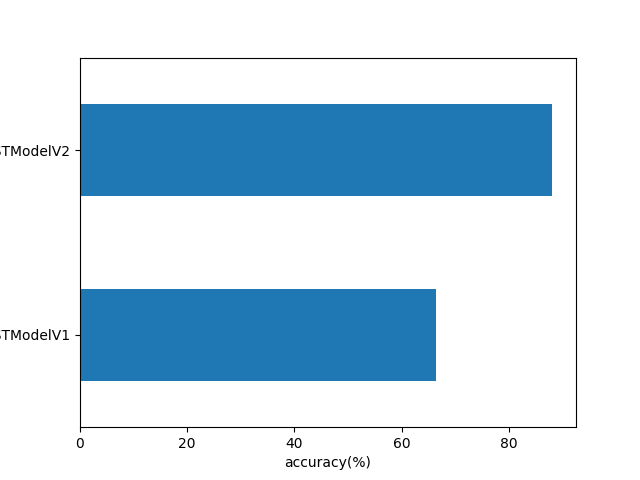
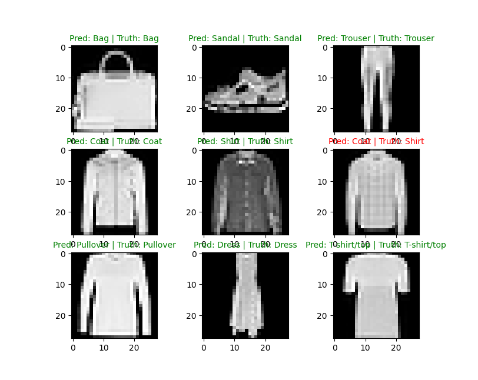
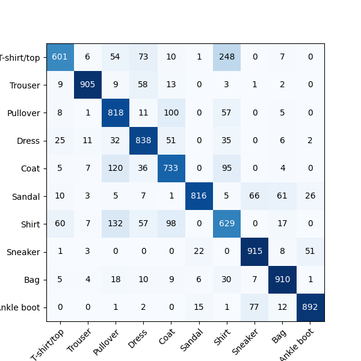

# CNN on FashionMNIST with PyTorch (TinyVGG Architecture)

This project demonstrates how Convolutional Neural Networks (CNNs) significantly outperform traditional fully-connected models on image datasets.  
We train two models — a basic non-linear neural network (MLP) and a CNN using the **TinyVGG** architecture — and compare their performance on the **FashionMNIST** dataset.

---

## 🔍 Overview

We use the **FashionMNIST** dataset to classify 28x28 grayscale clothing images into one of 10 categories (e.g., shirt, sandal, coat).  
The project involves:

- Building and training two models:
  - `Model 1`: A non-linear neural network (MLP)
  - `Model 2`: A CNN based on **TinyVGG**
- Comparing accuracy and training time
- Visualizing predictions and confusion matrix
- Saving/loading the trained model

---

## 🧠 Why CNNs Are Better for Vision Tasks

Unlike traditional MLPs that treat images as 1D vectors, CNNs:
- **Preserve spatial structure** using convolution filters
- **Share weights** across pixels, making them more efficient
- **Capture local patterns** like edges, corners, textures, etc.
This makes CNNs ideal for image-based tasks — and you’ll see that clearly in our results.

---

## 🏗️ Model Architectures

### 🔹 Model 1: Non-linear Neural Network (MLP)
- `Flatten → Linear(784→10) → ReLU → Linear(10→10) → ReLU`
- Fast but limited in performance on images

### 🔹 Model 2: CNN (TinyVGG)
Based on the [CNN Explainer website's TinyVGG](https://poloclub.github.io/cnn-explainer/):
- Two convolutional blocks:
  - `Conv → ReLU → Conv → ReLU → MaxPool`
- Followed by:
  - `Flatten → Linear(hidden_units*7*7 → 10)`

---

## 📁 Project Structure
<pre>
FashionMNIST-CNN-pytorch/
├── fashion_mnist_cnn.py #Main training & evaluation script
├── data_1 #where all the training and testing data is stored (if folder not found it will get created once runned)
├── models/
│ └── CNN_model.pth #Saved PyTorch model (TinyVGG)
├── assets/
│ ├── accuracy_model_graph.png #Accuracy vs Models graph for accuracy comparison
│ ├── confusion_matrix.png #Confusion matrix visualization
│ └── prediction_examples.png #Random prediction visualization
├── requirements.txt #Dependencies
└── README.md #You are here!
</pre>

---

## 📊 Results

| Model   | Accuracy (%) | Training Time (s) |
|---------|--------------|-------------------|
| MLP     | ~66%         | 16.898            |
| CNN     | ~88%         | 19.629            |

> 📈 CNN achieves much better performance thanks to its ability to learn spatial features in images.
Training time will depend significantly from hardware to hardware.

Accuracy vs Model graph, sample prediction visualizations and the confusion matrix are shown below:

  

---

## 🚀 How to Run

### 🔧 Requirements
1. Clone the repository:
    bash
    git clone https://github.com/PrathameshDeshpande99/FashionMNIST-CNN-pytorch.git
    cd FashionMNIST-CNN-pytorch

2. Install dependencies:

    bash
    pip install -r requirements.txt

3. ▶️ Run the training script:

    bash
    python fashion_mnist_cnn.py

---

## 🧠 What I Learned
1. The difference between MLPs and CNNs for image classification
2. How to build a CNN from scratch using PyTorch
3. Using DataLoaders and batch training
4. Tracking metrics like accuracy and loss
5. Saving and loading model weights
6. Visualizing predictions and confusion matrix

---

## 🧑‍💻 Author
Prathamesh Vijay Deshpande
B.Tech CSE, IITT (2nd Semester)
This is my first deep learning project using CNNs in PyTorch.

---

## 📚 Acknowledgements
I would like to express my sincere gratitude to Prof. **Dr. Chalavadi Vishnu** for his valuable guidance during the early stages of this project, for recommending the CS229 video lecture series, and for encouraging me to learn PyTorch.

Huge thanks to the following amazing resources that helped me build this project:

Official PyTorch Documentation
freeCodeCamp: PyTorch for Deep Learning and Machine Learning (YouTube)
Stanford CS229: Machine Learning Lecture Series (YouTube)

---

## 📌 Future Work
1. Try using Adam optimizer and compare with SGD
2. Extend to custom-datasets or real-world image datasets
3. Add more complexity to it.